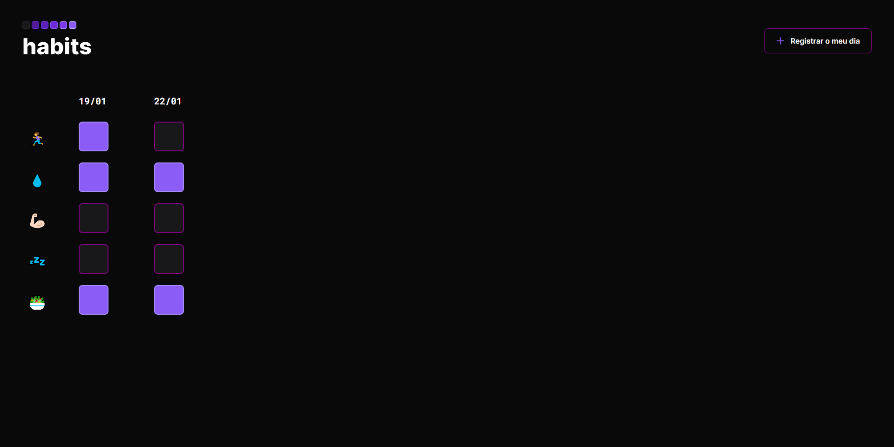

<h1 align="center"> Bem vindo ao meu github</h1>

 Este é o meu primeiro projeto feito em HTML, CSS e JS fico feliz em compartilhá-lo aqui

https://github.com/000ewf
<h3 > - Preview do projeto: </h3>

 O projeto foi desenvolvido em conjunto com a NLWSetup da Rocketseat e as tecnologias usadas foram: 

## Tecnologias

- HTML e CSS
- Javascript
- Git e Github
- Figma

O Habits é um APP que ajuda a rastrear os hábitos de uma pessoa.
